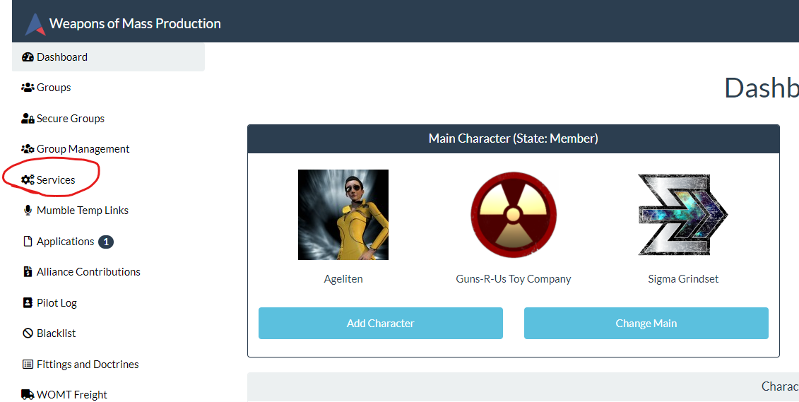
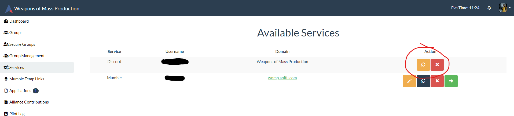
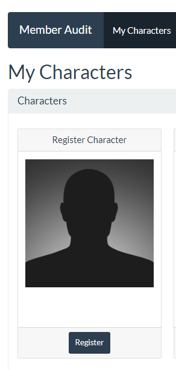

# Guns 'R' Us Toy Company Authentication

Access [Guns 'R' Us Toy Company Auth](https://womp.aoifu.com/)

You are probably already somewhat familiar with out corporation authentication page. It is what you used to submit the application to join. We use it for more than just recruitment though, it's also used to grant access to Discord and SIGs (Special Interest Groups) within the corporation.

Here's a list of the various information and services on the authentication site:

* Groups - Apply to SIGs
* Secure Groups - SIGs with special requirements
* Services - Access to Discord
* Fittings and Doctrines - Active corporation doctrine fits
* Member Audit - Register all your characters here
* Alliance Contributions - Moon Mining 
* Ship Replacement - SRP program

There's also some mothballed services, these are discontinued until further notice because the services is provided at alliance level:

* ❌ WOMT Freight - Hauling service

## 📌 Access to Discord
The first step is making sure you have full member access to our Discord channel. All our corporation coordination and communication happens here.

### 1. Open Services Page
Open the `Services` page on the corp authentication page.

### 2. Join Discord
There should be two services listed on the page. Use the `Action` buttons on the right hand side to join discord. You will be added to the GUNS- discord server with your in-game character name. Please say hello once you're there 👋!

## Mumble
❌ _Mumble is mothballed currently since we're using the Sigma Grindset server_

## 📌 Member Audit
We use the member audit to make it harder for spies to join the corporation. This effort makes the space safer for all of us. Please go to the `Member Audit` page and ensure all your characters is registered there.

