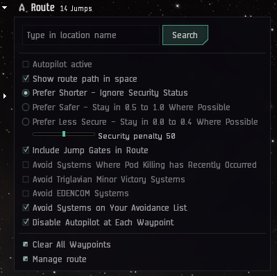
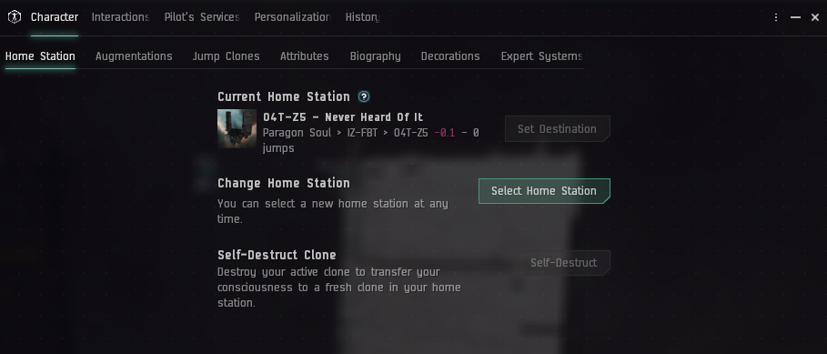

---
hide:
    - navigation
---

# Traveling to O4T-Z5
The Paragon Soul region is located in the south eastern part of New Eden. It's tucked in behind Period Basis and Esoteria. There is no direct highsec or lowsec connection. Fortunately we have access to the entire Imperium Jump Bridge network, which makes traveling to staging easy.

## 1. Moving from Highsec space
The most convenient route to Paragon Soul is going through Querious and Period Basis, utilizing the Jump Bridge network. A good starting point is [Badivefi](https://evemaps.dotlan.net/system/Badivefi) in Khanid region. Move your characters to this system before proceeding with the next step. It's recommended to use shuttles for transportation.

## 2. Plotting the course
From `Badivefi` it's possible to set a direct route to `O4T-Z5`. Search for `O4T-Z5 - Never Heard Of It` and set destination. It should be `14` jumps.

### Troubleshooting
If the route is longer than `14` jumps there might be some issue preventing jump bridges being included, try the following:

* Log out and then log in again
* Make sure `Include Jump Gates in Route` is enabled
* Check system avoidance list
* Select `Prefer Shorter - Ignore Security Status` option

## 3. Follow the route
After ensuring the route is correct you can start moving. You will move through blue (frienly) space the entire way, but still try to be vigilant in case there is any roaming gang of hostiles.

## 4. Set home station
Once arrived in `O4T-Z5 - Never Heard Of It` set it as your home station. This will ensure you always have a quick way back to the staging station.

### Quick Reference
| Destination | Starting Point | Jumps |
|---|---|---|
| O4T-Z5 - Never Heard Of It | Badivefi | 14 |

1. Move to Badivefi
2. Set destination
3. Follow the route
4. Set home station